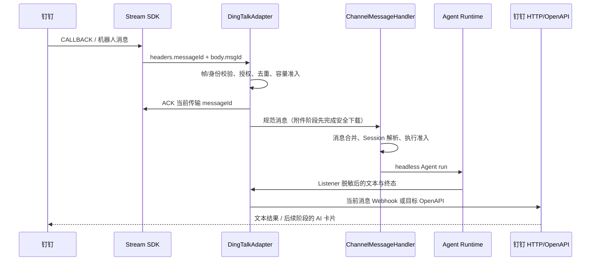

# 钉钉 Channel 接入方案

状态：已在 `feat/dingtalk-channel` 实现文本、主动通知、文件收发和可选 AI 卡片；真实企业账号验收待完成。核对日期：2026-09-29。
代码基线：`cd2a92e81362ffcec7a64955cc452382d9b55639`，包含尚未合并的[企业微信 PR #21174](https://github.com/CherryHQ/cherry-studio/pull/21174)。本方案独立于该 PR，不修改其交付范围。

## 1. 目标与交付边界

用户在钉钉单聊应用机器人，或在群内 @机器人，调用 Cherry Studio 中绑定的 Agent，并在原会话收到结果。复用现有 Channel、Agent Runtime、Session、任务通知与消息持久化。

推荐以**企业内部应用机器人 + Stream 接收 + HTTP/OpenAPI 发送**接入，不要求桌面暴露公网回调地址。一个 Channel 绑定一个 Agent，同群共享 Session，不同私聊、群和 Channel 的聊天历史独立。

按可独立验收的能力分阶段：

| 阶段 | 用户可见能力 | 成立条件 |
| --- | --- | --- |
| P1 文本闭环 | 配置、连接、单聊/群 @、命令、最终文本回复、主动任务通知 | SDK 前置问题解决；真实账号完成双向文本与主动发送验收 |
| P2 AI 卡片 | 可选卡片模板、累计正文流式更新、成功/暂停/失败终态 | 模板、卡片权限、投放场域及频率核实 |
| P3 附件 | 图片/图文输入；平台允许的文件收发 | 单聊和群聊分别核实类型限制、媒体 API 与安全下载 |

P1 不逐 token 发送普通消息，不显示无法结束的“正在输入”占位。P2 未配置卡片模板时继续使用 P1 文本模式。长任务和定时通知不能依赖临时 Webhook，主动文本发送属于 P1 验收条件。

不包含第三方企业应用授权、多租户服务、自定义群 Webhook 机器人、个人账号登录、考勤/审批等办公工具、远程工具审批、客户端退出后的代收或跨重启补发。群白名单决定能否调用，不能限制群内其他成员阅读回复。

## 2. 官方依据与核实程度

| 来源 | 本次核实 | 尚不能据此承诺 |
| --- | --- | --- |
| [官方 SDK 概述](https://open-dingtalk.github.io/developerpedia/docs/develop/sdk/overview/) | `dingtalk-stream` 为官方 Node Stream SDK；Stream SDK 与 OpenAPI SDK 职责分开 | Stream SDK 已封装全部消息、媒体和卡片 API |
| [机器人接收消息](https://open-dingtalk.github.io/developerpedia/docs/learn/bot/appbot/receive/) | 支持单聊、群 @，推荐 Stream；附件使用 downloadCode | 当前账号所有群类型均可用、群内可接收任意附件 |
| [机器人回复/发送消息](https://open-dingtalk.github.io/developerpedia/docs/learn/bot/appbot/reply/) | WebSocket 不用于回复 IM；SessionWebhook 为临时地址，过期时间来自回调字段；主动发送使用 OpenAPI | Webhook 永久有效、所有接口共享长度或调用配额 |
| [Node 入门示例](https://opensource.dingtalk.com/developerpedia/docs/explore/tutorials/stream/bot/nodejs/build-bot/) | `TOPIC_ROBOT` 回调，`socketCallBackResponse` 确认接收；示例说明不确认会触发重投 | ACK 代表 Agent 已完成，或可等待长任务结束再 ACK |
| [官方消息解析实现](https://github.com/open-dingtalk/dingtalk-stream-sdk-python/blob/main/dingtalk_stream/chatbot.py) | 区分传输层与机器人消息；包含会话、成员、Webhook、过期时间及图片/图文字段 | 缺少 `senderStaffId` 时可用其他 ID 冒充企业 userid |
| [官方卡片示例](https://github.com/open-dingtalk/dingtalk-card-examples)、[AI 卡片实现](https://github.com/open-dingtalk/dingtalk-stream-sdk-python/blob/main/dingtalk_stream/card_replier.py) | 卡片创建/投放与流式更新独立；更新携带 outTrackId、guid、isFull、isFinalize、isError | 账号无需额外权限、模板通用可用、重复请求必定幂等 |

本次打开[消息类型页](https://open.dingtalk.com/document/development/robot-message-type)、[媒体下载页](https://open.dingtalk.com/document/orgapp/download-the-file-content-of-the-robot-receiving-message)、[应用 Token 页](https://open.dingtalk.com/document/orgapp/obtain-the-access_token-of-an-internal-app)未获得可解析正文。相关细节必须在 P0 通过开发者控制台、API Explorer 和真实消息补核，不能把页面可访问当作接口已验证。

本轮未使用真实应用凭据，未建立钉钉连接，未验证配额、权限、代理或发行包。

## 3. SDK 选择与上游前置问题

已读取 npm 发布元数据及两个版本的声明和发布代码，而非只依据 GitHub 默认分支：

| npm 标签 | 版本 | 发布信息 |
| --- | --- | --- |
| latest | `2.1.6-beta.1` | [元数据](https://registry.npmjs.org/dingtalk-stream/2.1.6-beta.1)；gitHead `d9d346b3ef64ee3806c160969ba4742b9e19be5c` |
| beta | `2.1.7-beta.1` | [元数据](https://registry.npmjs.org/dingtalk-stream/2.1.7-beta.1)；gitHead `e7fe301d9afdcc1d62d2b7ffeba6fe7768b6489c` |

已固定 `2.1.7-beta.1`，其[发布说明](https://github.com/open-dingtalk/dingtalk-stream-sdk-nodejs/releases/tag/v2.1.7-beta.1)包含连接清理修复；仍是预发布版本。依赖属于生产 dependencies；CJS/ESM 入口有回归测试，发行包的真实网络连接仍需验收。

发布代码暴露的前置问题：

- `connect()` 的失败路径可捕获错误后返回，不能在 `await connect()` 后直接 `markConnected()`；`connected` 与 `registered` 是不同状态。
- SDK 更新连接字段，但缺少供宿主订阅的完整连接/注册/断线状态事件；需要可靠传播设置页状态和实例终止。
- 多处直接调用 `console.*`，`debug: false` 不能关闭全部日志，且没有 logger 注入接口；网络错误对象可能携带请求细节。
- SDK 提供重连；宿主不能同时再启动一套重连循环。当前公开配置也不能直接等同于 Cherry 的代理配置。

维护者已批准最小依赖补丁：[dingtalk-stream 补丁](../../../patches/dingtalk-stream@2.1.7-beta.1.patch)补齐注册/断线事件、logger 注入及 gateway HTTP 取消；携带凭据的 gateway 请求禁止重定向。SDK 仍独占重连逻辑，Adapter 不访问私有 socket、不复制协议、不全局替换 console。宿主丢弃 SDK 原始日志参数，仅通过渠道 logger 报告固定诊断。升级版本时应优先确认上游是否已提供这些能力并移除对应补丁。

另已查看 [DingTalk Channel SDK](https://github.com/DingTalk-Real-AI/dingtalk-channel-sdk-nodejs) 的 README。它封装了排队、批处理、授权和卡片，可能与 Cherry 的 ChannelMessageHandler 和工具策略重复；发布与禁用这些内置策略的合同尚未核实，暂不作为首选。不引入其他 Agent 框架的完整连接器作为运行依赖。

## 4. 配置与用户流程

P1 在既有 Channel 实体外层使用 `type: 'dingtalk'`，`config` 为：

```json
{
  "client_id": "",
  "client_secret": "",
  "robot_code": "",
  "allowed_chat_ids": [],
  "allowed_user_ids": []
}
```

- Client ID 和 Robot Code 去边缘空白；Secret 保持原始字节。P0 核实选定应用类型中 Robot Code 与 Client ID 的关系；确认恒等才能省去重复输入，否则分别保存，不能静默猜测。
- 禁用草稿允许凭据未填完整；启用校验凭据和机器人标识，不新增扫码或无效的渠道权限覆盖开关。
- `allowed_chat_ids` 使用第 5 节规范 ID，`allowed_user_ids` 使用企业内 `senderStaffId`。两者同时配置取交集，空数组表示该维度不限制。
- 同 Client ID 在本地仅允许一个启用配置，避免意外的多实例消息分配。创建、更新、启用及 Agent 工具写入共用同步事务校验；禁用草稿可重复。这是 Cherry 的产品约束，不宣称钉钉平台只允许单连接。
- Agent、workspace 和 isActive 沿用外层字段；Token、Webhook、downloadCode、卡片实例及临时投递状态不写入配置 JSON。
- 已加入可选 `card_template_id`，模板字段固定为 `msgContent`（正文）和 `flowStatus`（2 生成中、3 完成、5 失败）；未配置时使用普通文本，不开放任意 JSON 模板编辑器。

设置流程：创建并发布企业内部应用机器人 → 接收方式选 Stream → 配置应用可见范围、群安装及所需权限 → Cherry 新建钉钉禁用草稿 → 填凭据、绑定 Agent/工作区、设置白名单 → 启用 → 私聊和群 @各完成一次验证。`/whoami` 返回可直接配置的身份；仍走白名单，拒绝日志保留必要 ID 供本地配置者核对。

新增 UI 使用 `@cherrystudio/ui`、遵守 [DESIGN.md](../../../DESIGN.md)，全部文案走 i18n。说明群内共享上下文、空白名单语义以及 Cherry 需要持续运行。凭据沿用现有配置持久化，不宣称已加密；Secret 输入遮罩，状态及工具结果不回显密钥。

## 5. 身份、Session 与通知目标

首版只覆盖选定企业内部应用所属组织中可解析为 `senderStaffId` 的成员，不混用 unionId、senderId、staffId。外部联系人等身份缺失场景明确不执行；后续扩展需要独立身份与权限设计。

| 原始字段 | Cherry 规范化或用途 |
| --- | --- |
| `conversationType = '1'` + `senderStaffId` | `chatId = conversationId = dm:<staffId>` |
| `conversationType = '2'` + `conversationId` | `chatId = conversationId = group:<conversationId>` |
| `senderStaffId` / `senderNick` | userId / 展示名；昵称不用于授权 |
| `msgId` | Channel messageId、业务去重、定位当前回复 |
| `headers.messageId` | Stream 传输 ACK，不能当作业务 msgId |
| `sessionWebhook` / `sessionWebhookExpiredTime` | 当前消息的临时回复能力与绝对过期时间 |
| `robotCode` / `chatbotCorpId` / `senderCorpId` | 与已配置应用及接入范围核对；不能用入站值替换配置凭据 |

保留原始会话 ID 的大小写和不透明字符串，不截断、不拆平台内部编码。群主动发送需要的 `openConversationId` 与回调 `conversationId` 是否等价须用所选接口实测；若不能直接复用，P0 先确定官方转换途径与持久字段，不能从群名反查猜测，也不能直接把两者视为相同。

现有 `agent_channel_session` 的活跃唯一约束为 `(channelId, conversationId)`。同群所有已授权成员共用历史；不同 Channel 隔离。Agent 改绑时沿用归属检查，`/new` 切换活跃 Session，不取消旧执行，旧回复仍定位原 msgId。历史隔离不等于工作区文件隔离。

选择上述规范 ID 是为让持久 `activeChatIds` 自身携带可发送的目标类型，应用重启后无需恢复旧 Webhook 才能通知。私聊可从 ID 得到 staffId；群在 P0 确认地址映射后成立。固定通知列表与动态目标沿用现有规则，发送前重新检查白名单；任务不借用“最近一次入站消息”的回复上下文。

仅新增 type 和 config 字段不需要迁移：现有类型列为文本，没有类型 CHECK，配置为 JSON。若 P0 证明必须持久化额外的群地址映射，或另立持久收件箱需求，则重新评审并追加迁移，不能改写已发布迁移。

## 6. 入站处理与 ACK



只订阅 `TOPIC_ROBOT`；不沿用 SDK 默认的 `EVENT *` 通配订阅。不为首版订阅办公事件、所有消息或卡片交互。

ACK 与业务执行分开：先完成轻量校验、授权和有界内存准入，再立即响应 Stream；模型执行、附件下载和卡片发送不阻塞 ACK。响应体按锁定版本及机器人 CALLBACK 协议确认，不把 EVENT 的 SUCCESS/LATER 结构直接套到机器人 CALLBACK。

- 去重键使用 `(clientId, msgId)`。同一业务消息的重投逐帧 ACK，但只执行一次；重复帧不重复下载、创建 Session 或投放卡片。
- 未授权、已知不支持的类型及永久无效消息：可识别的回调 ACK 后不执行；仅对已授权且可回复的来源给出提示。
- 容量耗尽或准入暂时失败：使用已核实的回调重试机制，不能记成“已接受”又静默丢弃；若机器人协议不提供合适重试语义，则 ACK 并给已授权来源明确忙碌反馈。
- ACK 后进程崩溃仍可能丢失尚未执行的消息。本方案仅承诺进程内去重，不承诺持久队列或 exactly-once。

建议初始内存预算：去重 1000 条/10 分钟，待处理消息 32 条，回复上下文 1000 条。它们是应用容量参数，非平台限制；实现时通过压力回放确定。活跃上下文不能被 LRU 驱逐，满额时拒绝新准入；消息合并只使用最终选中的 msgId 回复。

同群不同成员的重叠请求沿用 `requireIdle`，忙时可见反馈，不新增第二套会话排队器。群触发优先依赖平台 @规则并核验 `isInAtList`；不通过删掉所有 `@xxx` 改写用户原文。

## 7. 文本回复、主动发送与网络边界

### 7.1 投递选择

有 `replyToMessageId` 时按 `(chatId, msgId)` 查上下文，校验其 Webhook 未过期后发送；有效期严格取回调绝对时间，不从首 token 重新计时，也不硬编码为“一小时”。无上下文或已过期时走对应目标的主动 OpenAPI。

P0 必须分别确定并记录：单聊发送、群发送、Token 获取、消息 msgKey/msgParam、权限名称、HTTP/业务错误码、长度度量单位与限额。HTTP 200 不等于发送成功，私聊批量接口还要检查目标失败明细。本方案不把其他机器人的接口配额套到应用机器人。

普通文本只在终态投递一次；空成功显示中性的“执行已结束，未产生文本回复”，暂停不猜测为等待审批。分段保留 Unicode 和代码块，按实测的对应接口限制编号发送；部分分段成功必须记录已送达范围，不能无条件从第一段重放。无法完整送达时，完整正文仍留在 Cherry Session，并记录失败。

Webhook 明确过期或明确未投递时可切主动发送；响应超时属于结果未知，不能自动再发一份。不要因发送失败重新执行 Agent。Token 失效可刷新一次，但重发业务请求仍须满足“已明确拒绝/未提交”或经验证的幂等条件。

### 7.2 Token 与请求安全

已评估官方 OpenAPI SDK：`@alicloud/dingtalk@2.2.48` 发布物约 60 MB，依赖 Tea 网络栈。当前接入只需要固定的机器人和卡片端点，并需复用 Electron session 代理、AbortSignal 和禁止重定向的传输边界，因此由 `DingTalkApi` 使用 `net.fetch` 实现这些有限调用，不引入完整 OpenAPI SDK。Token 由 Adapter 所属 API 客户端按返回有效期内存缓存，并合并并发刷新；不逐 token、逐流更新获取 Token，不把原始 Axios 错误或请求配置写日志。

固定 OpenAPI 地址不允许用户配置任意 host。回调 Webhook 必须验证 HTTPS、无 userinfo、精确的受信任主机和经验证的路径，禁止重定向，不能把带 Token 的请求发送到任意回调 URL；白名单来自 P0 的官方接口与样本，不能仅用字符串后缀判断。

网络路径的当前边界：OpenAPI 使用 Electron `net.fetch`；Stream 使用 SDK 的 Node ws/axios（不承诺继承 Cherry 的应用代理）；签名媒体下载使用共享 DNS 固定的直连 HTTP。三条路径的实际代理环境仍需联调，不能把 HTTP 代理成功等同于 Stream 与媒体可达。

## 8. 连接与实例生命周期

`DingTalkAdapter` 由现有 ChannelRuntime 所有，不新增全局 DingTalkService。先注册回调及状态监听，再 connect；只有已建立连接且订阅注册成功才标在线。初始连接建议 30 秒预算，到期失败必须取消旧连接尝试；连接失败展示凭据/网络检查提示，不泄露平台原始响应。

网络重连由 SDK 唯一负责，Adapter 负责实例存活与总预算，断线恢复预算为 5 分钟，耗尽则停止 SDK、标错误并等待明确重连。此预算通过补丁的状态事件落实，不能用 `connect()` 是否抛错来推断。

Stream 断开不代表 HTTP 发送必定不可用。`isStreamListenerAlive()` 按实例是否仍拥有当前执行判断：短时断线仍收终态，HTTP 可用则继续发送；主动禁用、删除或改绑后旧实例停止所有发送、HTTP 请求、重连与卡片更新。SDK 迟到的注册成功不能复活旧实例。

P1 不新增自动离线结果补发队列。若 HTTP 也失败，记录投递失败/结果未知，保留 Session 正文；之后新增补发能力须单独定义容量、时限与幂等。停止 Adapter 不等于停止 Agent，执行终止仍归 Runtime 管理。

## 9. AI 卡片阶段

卡片属于 OpenAPI 能力，Stream 仅在需要交互时承载回调。首版卡片只呈现回答，不加入审批按钮或工具授权入口。

1. 固定模板定义正文和状态字段；用户在钉钉发布模板并授予所需权限，Cherry 校验模板 ID。普通文本设置无需卡片权限。
2. 每个执行使用稳定且唯一的 outTrackId，不只按 chatId 建卡；`/new` 后的旧执行不会覆盖新卡。
3. 仅在选中的回复目标上创建并投放一次。保存“已创建”和“已投放”的区别，创建/投放结果未知时不盲目创建新卡。
4. 复用 FlushController 合并累计正文，建议 500ms 起步且同一卡片单次在途；按账号限流调整，只保留最新文本，避免乱序回滚。
5. 使用全量更新语义（isFull）和相应终态参数；请求 guid 与卡片 ID 分工不同，重复 guid 的含义须实测，不能凭名字推断幂等。
6. 完成、暂停、错误及空正文都结束卡片。Adapter 接管最终投递返回 handled，Listener 不再重复发送完整文本；任务的 suppressDelivery 仍生效。
7. 模板/权限明确失败且尚未投放时回退文本；已有卡片更新失败先报告状态，不用不受控的双通道重发掩盖结果未知。

卡片长度、更新频率、可更新时限、投放目标类型及转发后的可见性均列入 P2 真机矩阵；不复用企业微信 2048 字节或 170 秒常量。

## 10. 附件阶段

入站通过 downloadCode 和配置的 Robot Code 获取临时下载 URL，再调用共享 `fetchRemoteBytes`；当前方法来自 #21174。识别真实 MIME、净化文件名，转换为现有 ImageAttachment/FileAttachment，由 Handler 保存到 Session 工作区。

临时 URL 属于不可信网络输入，沿用共享 DNS 固定、大小限制、超时、逐跳重定向验证以及现有私网偏好策略。下载请求不携带应用 Token；不要把 `x-acs-dingtalk-access-token` 传给 CDN 或重定向目标。若平台必须使用特殊下载鉴权，先在共享边界设计其精确作用域。

入站应用预算为单文件 20 MiB、单消息 40 MiB、附件最多 20 项、并发 4、等待 32 条、下载时限 30 秒，最终取应用与平台限制较小值。预算在读取过程中执行，不能下载完才检查；图文中任一必要附件失败，则整条消息不启动 Agent。

单聊文件、群文件、图片、图文必须分开确认平台支持情况，不能把“支持 downloadCode”解释为群里可收所有文件。语音、视频、卡片及未知类型先明确提示不支持，不把部分可读文字当成完整任务执行。

出站复用现有授权工作区文件解析，通过对应媒体上传与机器人消息接口发送；不接受远端指定的任意本地路径，不把本地文件转成公共 URL 来绕过平台限制。发送失败向调用工具返回失败，不把上传成功当作交付成功。当前出站使用 `/media/upload?type=file` 和 `sampleFile`；非空文件最多 20 MiB，与[官方连接器普通上传实现](https://github.com/DingTalk-Real-AI/dingtalk-openclaw-connector/blob/main/src/services/media/common.ts)一致，不包括其分片大文件路径。按实际解码字节复核上限，文件名须带扩展名，扩展名的最终支持范围由平台校验；没有额外应用白名单。普通文本按 1800 UTF-8 字节分段，这是当前保守发送预算，不代表所有钉钉文本接口的统一上限。

## 11. 实现文件

| 位置 | 计划 |
| --- | --- |
| `src/shared/data/types/channel.ts`、`src/shared/data/api/schemas/agentChannels.ts` | 增加 dingtalk 配置、类型及启用校验，同步所有 union |
| `src/main/ai/channels/adapters/dingtalk/DingTalkAdapter.ts` | 平台映射、授权、去重、ACK、回复上下文与实例清理 |
| 同目录 `DingTalkApi.ts` | Token、文本、卡片及媒体发送；不新增跨渠道框架 |
| `src/main/ai/channels/channelAdapterLoader.ts` | 懒加载 Adapter |
| `src/main/data/services/AgentChannelService.ts` | 同应用启用冲突的同步事务校验 |
| `src/main/ai/mcp/servers/cherryAutonomyTools.ts` | 支持类型目录、必填字段、credentials 模式、文件能力说明；status 不泄露凭据 |
| `src/renderer/pages/settings/ChannelsSettings/` | 钉钉入口、表单、验证及设置说明 |
| Main / Renderer locale catalogs | 新文案先改 en-us，再 sync 并完成所有翻译 |
| `package.json`、`pnpm-lock.yaml` | 经过 P0 验证后锁定依赖；本轮不改 |
| 各受影响模块 `__tests__` | 合同测试与现有渠道回归 |

沿用 ChannelRuntime 的实例替换、ChannelMessageHandler 的命令与 Session、ChannelAdapterListener 的脱敏与唯一终态、现有任务通知目标。配置读取走 DataApi，连接等命令走现有 `channel.*` IpcApi，不建立 renderer WebSocket。

本方案依赖 #21174 的 `isStreamListenerAlive()`、终态结果/suppressDelivery 合同及安全二进制读取。实施前核对其最终合并形态；若钉钉需要先合并，先独立提交共享前置能力，不复制企微实现或把企微提交混入钉钉功能 PR。

## 12. 实施顺序与验收

| 步骤 | 产出 | 验证 |
| --- | --- | --- |
| P0 协议与依赖 | SDK 决策、应用配置清单、脱敏样本、接口与限额表 | 真实单聊/群 @、ACK 重投、群地址映射、Webhook 过期、主动发送、连接中取消与状态事件；上游决策通过 |
| P1 配置与文本 | Schema、表单、SDK 连接、消息与命令、最终回复、通知 | 配置持久化、重复启用拒绝、Session 隔离、忙碌反馈、重投单执行、长任务可交付 |
| P2 卡片 | 模板流程与单卡片串行更新 | 创建/投放失败、乱序、长文本、空输出、暂停、错误及重复终态，权限不足回退 |
| P3 附件 | 受限下载、消息转换、授权文件发送 | 各会话类型的图片/文件往返、过期码、超限、重定向、重复消息、不完整附件拒绝 |
| 发布验收 | 支持范围与设置文档 | 目标系统发行包、代理、睡眠唤醒、凭据轮换、禁用/改绑无旧发送 |

最低合同矩阵：

- 两名用户私聊、两个群、两个 Channel：不同会话不串历史，同群授权成员共享历史；改绑 Agent 不沿用旧 Agent Session。
- 同消息重复投递：每个传输回调获得正确 ACK，业务只有一份；ACK 后崩溃的非持久边界如实记录。
- 同发送者合并、同群并发、`/new` 后旧执行完成：结果只落到自己的回复上下文。
- 未授权、缺身份、错误应用 ID、群非 @：不创建 Session、不进入动态通知列表、不下载附件。
- Webhook 过期、主动发送无权限、HTTP 业务失败、超时结果未知、分段中途失败：不假报成功、不重复执行。
- Stream 断开但 HTTP 可用：运行结果继续交付；禁用或改绑后任何迟到回调都不能发消息。
- Token 并发刷新、取消中的连接、反复启停：无重复长连接、遗留定时器或凭据日志。
- 卡片终态和任务错误通知：只投递一次；秘密、工具原始输出与思考内容不进入文本或卡片。

数据库测试使用 `setupTestDatabase()` 和生产迁移；服务 mock 使用[统一机制](../../../tests/__mocks__/README.md)。UI 测试遵守[前端测试规范](../testing/frontend-testing.md)，用用户操作验证保存、重开和校验反馈，不以 mock 调用次数替代合同。

代码阶段运行 `pnpm lint` 与受影响的 Main、Shared、Renderer、Scripts 定向测试；涉及公共 Listener 时覆盖既有渠道和任务通知。文档另运行 `pnpm docs:check`。新增定向测试覆盖配置规范化/启用互斥、收信授权和去重、原始回复上下文、附件完整性、主动通知、HTTP 业务错误、上传边界、卡片终态、停用取消和 SDK 生命周期；这些不能替代真实账号测试。

## 13. 真实账号验收与已知边界

1. 使用企业内部应用启用 Stream，开通机器人消息发送、文件下载/上传及可选卡片权限；Robot Code 独立填写，不自动假定等于 Client ID。
2. SDK 的最小补丁已获授权并实现；应用内代理对 Stream 的支持和发行包网络行为尚未验证。
3. 由可用的企业内部应用完成 P0，确定权限、Robot Code、群地址、各类限额及真实样本；在此之前不宣称平台闭环完成。

除上述真实账号验收外，不扩展到企业管理功能、审批或新的 Agent 权限模式。
