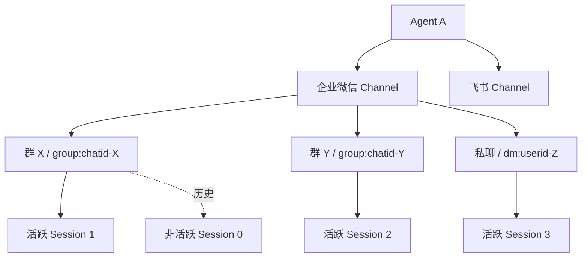
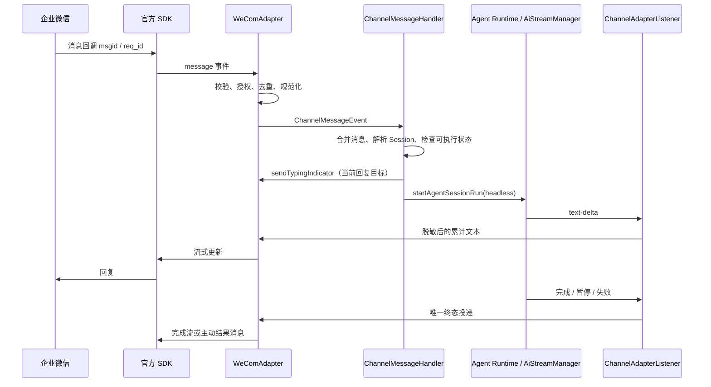
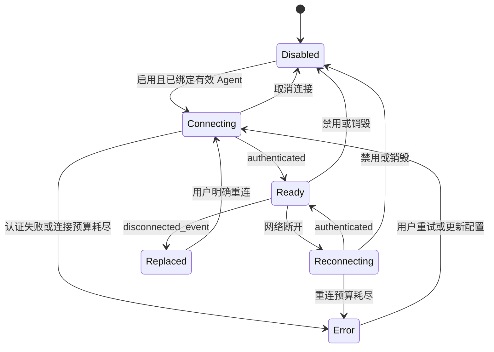

# 企业微信 Channel 接入方案

状态：本地实现与自动化验证已落地；企微真实账号、配额、时限和代理仍待联调。记录日期：2026-09-29。
仓库核对基线：`71bfd235bab5fea285e3848a6ca92742aafc3165`。

第 1–13 节保留设计目标与验收合同，第 14–15 节记录当前实现和验证状态。文本与附件实现一并提交评审；真实平台验收及 Agent 配置工具的渠道登记尚未完成。

## 1. 目标与决策

用户在企业微信单聊智能机器人，或在群内 @机器人，可以调用 Cherry Studio 中绑定的 Agent，连续对话并接收流式结果、任务通知和附件。

采用独立的 `wecom` Channel，通过企业微信智能机器人 API 长连接模式接入。桌面主进程主动建立 WebSocket，不增加公网回调服务器。使用官方 `@wecom/aibot-node-sdk`，复用现有 Agent Runtime、Session、ChannelManager 和消息持久化链路。

本方案的默认决策：

- 一个 Channel 配置绑定一个 Agent；一个机器人可以服务多个群和私聊。
- 同一群共享对话上下文；不同群、不同私聊、不同 Channel 的上下文分开。
- 通过 Channel 白名单控制调用入口，通过现有 Agent 工具策略决定允许的操作。
- 第一阶段交付文本、流式回复和主动文本通知；第二阶段交付图片与文件收发。
- Cherry 必须运行且能够连接企微服务。不承诺客户端退出后的代收、离线执行或跨重启补发。

本次不实现：自建应用回调、传统群 Webhook 推送模式、微信客服、客户群消息采集、企微私有部署地址配置、企微内审批卡片，以及新的多 Agent 路由规则。需要这些能力时另行定义接口与产品范围。

## 2. 外部依据与验证边界

以下事实在记录日期核对。SDK 能力、平台限制和实际账号权限分别验证，不能相互替代。

| 依据 | 已核实内容 | 使用边界 |
| --- | --- | --- |
| [腾讯官方接入说明](https://cloud.tencent.com/document/product/1759/121473) | 长连接无需公网回调；支持单聊和群聊 @；列出单机器人单连接、3 分钟回复窗口 | 这是 ADP 接入文档，不能直接套用其中所有限制到原生 SDK |
| [官方 SDK 仓库](https://github.com/WecomTeam/aibot-node-sdk) | WebSocket、认证、流式回复、主动发送、媒体上传下载 | GitHub 默认分支与 npm 发布物可能不同 |
| [SDK 1.0.7 发布元数据](https://registry.npmjs.org/@wecom/aibot-node-sdk/1.0.7) | 本次查询的 npm latest 为 1.0.7；已读取发布包声明与 CJS 实现 | 建议实施时锁定 1.0.7，并按仓库依赖规则检查 `patches/` 和构建兼容性 |
| [官方消息类型](https://github.com/WecomTeam/aibot-node-sdk/blob/main/src/types/message.ts) | `msgid`、`from.userid`、群聊 `chatid`、媒体 URL 与 AES key | 以锁定版本类型和真实消息样本校验 |
| [官方连接事件](https://github.com/WecomTeam/aibot-node-sdk/blob/main/src/types/event.ts) | 新连接会触发旧连接的 `disconnected_event` | 发布包实现已包含停止争抢式重连的处理 |

发布包的 `gitHead` 为 `ea48edf7c99be0609fe9740050f4942f897a5d95`，但本次无法从公开 GitHub 路径读取该提交，因此版本核对以 npm 发布包为准。发布包提供 `replyStreamNonBlocking` 和 `hasPendingReplyAck`，无需自行实现 SDK 回执队列。

[企微长连接协议](https://developer.work.weixin.qq.com/document/path/101463)的上传初始化接口已核实：文件至少 5 字节，普通文件不超过 20 MB，图片 10 MB、语音 2 MB、视频 10 MB。SDK 的 512 KiB × 100 分片只是上传分片总容量，不替代各类型上限。普通消息首次回复时限、流式总时限及起算点、主动发送配额、断线后的回复上下文有效性和群触发规则仍需补核。

当前出站统一以 `file` 类型上传，按解码后实际字节校验最小 5 字节与现有 `20 * 1024 * 1024` 字节上限。官方文档使用 MB，未明确十进制/二进制换算，当前保留原有二进制口径，精确服务端边界待实测；此校验不代表已完成真实账号上传验收。入站单附件 20 MiB 与整条消息 40 MiB 仍为应用资源预算，不从上传合同推导接收限制。

长度限制必须区分消息类型：SDK 流式类型标注 20480 UTF-8 字节，ADP 页面另有 2048 字节描述。不能把任一值当作所有企微消息的统一上限。实施前用原生机器人核验并记录分类型常量。

## 3. 当前绑定模型与复用范围

当前实现位置：

- [Channel 数据模型](../../../src/main/data/db/schemas/agentChannel.ts)
- [Channel 数据服务](../../../src/main/data/services/AgentChannelService.ts)
- [消息调度与会话解析](../../../src/main/ai/channels/ChannelMessageHandler.ts)
- [Session 创建](../../../src/main/data/services/AgentSessionService.ts)

| 关系 | 现有行为与企微方案 |
| --- | --- |
| Channel → Agent | `agent_channel.agentId` 最多关联一个 Agent；未绑定时不连接 |
| Agent → Channel / Session | 均为一对多 |
| Channel → 外部会话 | 一个机器人配置服务多个群、私聊 |
| 外部会话 → 活跃 Session | `agent_channel_session` 对 `(channelId, conversationId)` 的活跃记录有唯一约束 |
| 历史 Session | `/new` 创建新的活跃关联，旧记录保留为非活跃；每个 Session 最多关联一个来源 Channel |
| Agent 改绑 | 复用 Session 前校验 `session.agentId`；A 的历史不会迁入 B，缺少 B 的可复用 Session 时新建 |
| 工作目录 | 创建 Session 时读取 Channel 的 workspace 来源；后续运行使用 Session 自己的 workspace |

`agent_channel.sessionId` 仍在 schema 中，但当前入站路由使用关联表。企微不使用这个旧字段，不在本次顺带删除它。

“上下文独立”指 Session 聊天历史独立，不等于文件系统或 Agent 配置隔离：多个 Session 可以引用同一个用户工作区，也共享 Agent 配置；选择系统工作区时，现有服务为每个新 Session 创建对应系统工作区。



不新增会话表或 Channel 类型 CHECK。现有类型列为文本、配置列为 JSON；仅加入 `wecom` 和配置字段不需要数据库迁移。若后续引入持久消息收件箱或补发队列，必须作为独立需求追加迁移。

## 4. 配置与用户流程

### 4.1 配置形状

以下是拟新增的 `channel.config`，`type: 'wecom'` 位于外层 Channel 实体。内部工具使用的带类型配置另按现有 `ChannelConfigSchema` 结构投影。

```json
{
  "bot_id": "",
  "secret": "",
  "allowed_chat_ids": [],
  "allowed_user_ids": []
}
```

- 草稿允许凭据为空，启用时要求 `bot_id`、`secret` 非空；不把占位掩码保存成真实密钥。
- `bot_id` 去除输入边缘空白；Secret 作为不透明凭据处理，不转换大小写。
- 会话白名单使用 `dm:<userid>` / `group:<chatid>`，用户白名单使用原始 `userid`；校验非空、去重、保留大小写。
- 两个白名单都配置时取交集；空数组表示该维度不限制，与现有 Channel 语义保持一致。
- 同一个 bot ID 在本地只允许一份启用配置；在共享的 Channel 写入校验层覆盖创建、更新、启用和 Agent 工具入口。禁用草稿可以重复；跨设备占用由平台事件报告。
- Agent、workspace、`isActive` 沿用外层字段，不复制到 `config`。不新增无效的 Channel 权限覆盖开关。

凭据沿用当前 Channel 配置持久化机制。本次核对未发现该服务的独立凭据加密层，不能宣称“已加密存储”。新增表单使用密码输入；工具状态输出不回显 Secret，日志不包含 Secret、媒体解密密钥或完整下载 URL。跨渠道的凭据存储升级不作为本方案暗含交付项。

### 4.2 设置流程

1. 在企微创建智能机器人，选择 API 长连接方式，取得 Bot ID 和 Secret。
2. Cherry 设置 → Channels → 企业微信 → 新增配置。初始为禁用草稿。
3. 填入凭据，选择 Agent、工作区，设置允许的会话和成员，然后启用。
4. 通过现有连接状态与日志确认认证结果，再发送第一条测试消息。
5. `/whoami` 返回可直接填写的规范会话 ID 和用户 ID。白名单校验同样作用于命令，不为身份查询开放未授权入口；配置者可从本地拒绝日志读取必要 ID。

界面明确提示：群内共享上下文；空白名单不限制调用；授权成员的回复在群内可见；Cherry 退出后不处理消息。同群成员白名单限制的是“谁能发起调用”，不能限制“谁能看到群回复”。

新 UI 使用 `@cherrystudio/ui`，遵守 [设计系统](../../../DESIGN.md)，复用现有表单与连接日志。第一阶段沿用 `connected/error` 状态合同，以日志区分连接中和重连中，不扩展所有 Channel 的状态枚举。文案全部走 i18n。

## 5. 模块职责与完整链路



| 模块 | 拥有的职责 |
| --- | --- |
| SDK | 协议帧、认证、心跳、网络重连、回执队列、媒体上传和密码算法 |
| `WeComAdapter` | 企微字段映射、白名单、消息去重、每次回复上下文、发送策略、资源清理 |
| `ChannelRuntime` | Adapter 实例所有权、配置变更协调、旧实例隔离与销毁 |
| `ChannelManager` | 生命周期、状态与日志发布、动态会话追踪 |
| `ChannelMessageHandler` | 消息合并、命令、Session 解析、执行准入、附件落入工作区 |
| `ChannelAdapterListener` | 收集运行输出、统一脱敏、终态回调与通用回退 |
| Agent Runtime | Agent 执行、工具策略、历史与运行状态；不认识企微 req_id |

新 Adapter 是现有生命周期服务拥有的资源，不另建全局单例或平行的 WeComService。SDK 日志通过 Adapter 的集中日志接口接入。

## 6. 入站、身份、去重与调度

### 6.1 字段映射

| 企微字段 | Channel 字段或内部状态 |
| --- | --- |
| `chattype=single` + `from.userid` | `chatId = conversationId = dm:<userid>` |
| `chattype=group` + `chatid` | `chatId = conversationId = group:<chatid>` |
| `from.userid` | `userId`；没有可信显示名时 `userName` 使用同一 ID |
| `msgid` | `messageId`，用于去重和定位回复上下文 |
| `headers.req_id` | Adapter 私有回复上下文，不作为 Session 标识 |
| `text.content` | `text` |
| 图片 / 文件 | 第二阶段转换为现有 `ImageAttachment` / `FileAttachment` |

发送时解析规范 `chatId`，单聊将 userid、群聊将原始 chatid 交给 SDK。白名单、动态 `activeChatIds` 和通知目标统一使用规范 ID，防止私聊与群聊 ID 碰撞。

处理顺序：检查帧及 bot ID → 解析聊天身份 → 白名单 → 去重占位 → 文本/附件转换 → 发出命令或消息事件。缺少必需字段不触发 Agent。只监听一次通用消息事件或一组互斥类型事件，避免 SDK 同时派发通用和细分事件造成双执行。

群入口以企微回调规则为基础。首版产品承诺群内 @触发，真实账号必须验证该规则；若平台还下发未 @消息，需要基于官方明确字段过滤，不能通过匹配机器人显示名猜测。文本保留用户原文，不粗暴删除所有 `@xxx`。

### 6.2 去重与容量

按 Adapter 内的 `(botId, msgid)` 使用有界 TTL 缓存。建议初始值为 1000 条、10 分钟，作为内部常量经回放验证，不新增用户设置。重复到达不再次下载附件或调用 Agent；同一实例网络重连保留去重记录。

去重承诺仅限进程内缓存有效期。主动禁用、重建 Adapter、应用重启或超出缓存窗口后，不保证平台重投不会再次执行。需要跨重启幂等时，应增加持久入站收件箱及执行回执，而不是把临时协议状态写进 Channel JSON。

回复上下文按 `(chatId, msgid)` 保存最小信息：req_id、stream ID、接收时间、回复期限、最新累计文本和投递状态，不保存整个消息帧或附件 base64。未入执行的上下文到期回收；活跃上下文设置数量上限，达到上限时显式拒绝新消息，不驱逐正在执行的上下文。

### 6.3 合并、命令与并发

- 复用现有按会话和发送者的短时消息合并。同一批消息使用最后一条 `messageId` 回复；较早消息仅保留短期去重信息和待过期上下文，不各自创建“处理中”流。
- `sendTypingIndicator` 只对选中的回复目标创建一次占位流；后续调用不能每次新建流，也不能覆盖已有正文。
- 同群共享 Session，但发送者不是 Session 分区键。当前 `requireIdle` 可能拒绝其他成员的重叠调用，需回复“会话忙”，不承诺可靠排队。
- `/new`、`/compact`、`/help`、`/whoami` 沿用现有命令与权限入口；其他文本交给既有 Agent 命令链路。
- `/new` 不隐式终止旧执行。旧执行始终回复它自己的 msgid，新 Session 不接管旧回复上下文。

## 7. 连接生命周期



状态图表达 Adapter 内部行为，不表示首版要新增跨进程状态枚举。

连接时先注册 SDK 事件，再调用 `connect()`；只有 `authenticated` 后才 `markConnected()`。SDK `connect()` 返回客户端对象，不是认证完成 Promise。`performConnect(signal)` 需要等待认证、终止或失败，并设置明确的连接等待预算，建议初始为 30 秒。

网络重连由 SDK 唯一负责，使用其有界退避；Adapter 不增加第二套重连定时器。凭据失败与网络失败分别报告；连接被其他客户端替换后不自动争抢。禁用、删除、配置修改或 Agent 改绑由 ChannelRuntime 序列化替换实例。

`performDisconnect()` 必须取消认证等待、停止 SDK、取消发送定时器、清除临时上下文和待发送结果，并使旧异步回调失效。SDK 回调还要检查实例是否已退役，防止旧认证结果把已禁用 Channel 标为在线。

临时断网不主动取消 Agent 执行。Channel 被禁用或改绑后，旧 Adapter 不再发送，也不把旧 Agent 结果补发到新绑定；Agent 是否继续运行沿用已有运行管理行为，不能通过停止 WebSocket 宣称执行已取消。

## 8. 流式回复、终态与恢复

### 8.1 正常流

1. 每个被选中的入站回复目标生成一个稳定 stream ID，更新中不更换。
2. Listener 将脱敏后的累计正文交给 Adapter，不向企微暴露原始工具参数、工具日志或思考过程。
3. 中间更新使用 SDK 1.0.7 的 `replyStreamNonBlocking`；`skipped` 表示暂不发送，保留最新累计文本即可，不补排所有 delta。
4. 根据实际平台频率上限复用 `FlushController` 做节流；建议初始合并窗口 500ms。SDK 回执队列和应用更新节流职责分开，不重写回执队列。
5. 完成时停止更新定时器，串行等待已有发送，提交完整最终文本及 `finish=true`，等待 ACK，再释放上下文。
6. 最终投递被 Adapter 接管后返回 handled，Listener 不重复发送全文。handled 表示投递责任已接管；若结果进入明确的短期补发状态，日志不能声称已送达。

所有长度计算使用 UTF-8 字节。长回答保持合法字符与代码块边界：流内显示有限预览，最终按已验证的主动消息上限发送完整分段内容，并标明分段。若主动发送不可用，给出截断提示，完整内容保留在 Cherry Session；不得静默丢弃后半段。

### 8.2 必须先补齐的公共层合同

当前存在三处接入相关限制，建议作为独立的前置改动修复：

| 当前问题 | 拟修改合同 | 验收结果 |
| --- | --- | --- |
| Listener 遇空文本 done/paused 直接返回 | 无论正文是否为空都通知 Adapter；通用回退不发送空消息 | 企微占位流、现有 Adapter 资源均可结束 |
| Listener 发送通用错误，MessageHandler 又调用 `onStreamError` | Listener 唯一拥有已启动执行的错误投递；Handler 只处理未启动失败与自身清理 | 流中错误只出现一次，准入失败仍可见 |
| `isAlive()` 等同 `adapter.connected`，断网即被 AiStreamManager 移除 | 在 ChannelAdapter 增加默认沿用 connected 的 `isStreamListenerAlive()`；WeCom 按实例是否仍有效判断 | WeCom 短时断网仍接收运行事件，退役后立即停止 |

拟扩展现有方法而不增加新的并行分发器：`onStreamComplete` 接收可选终态信息 `{ status: 'success' | 'paused' }`；`onStreamError` 返回是否处理错误投递的 boolean。现有 Feishu/Slack/Discord 实现同步适配返回值，基类未实现时返回 false，由 Listener 统一回退。

`StreamPausedResult` 当前没有可可靠区分取消和等待审批的原因字段，企微显示中性“执行已暂停”，不猜测具体原因。空输出显示“本次执行已结束，未产生文本回复”，不能据此宣称工具操作成功。

调度任务传入的 `suppressErrorMessage` 必须继续有效：任务失败摘要仍由现有任务通知路径负责，公共层不能再次发送通用错误。终态到来仍需清理已创建的显示状态；企微无入站上下文的任务通知不创建占位流。

### 8.3 回复超时与短时断网

回复期限从经验证的协议起点计算，包含消息合并、排队、附件处理时间，不能从首个模型 token 重新计时。

- 接近期限且连接有效：关闭当前流，说明执行仍在进行；最终结果通过主动消息发送。时限是传输限制，不自动转成 Agent 执行超时。
- 临时断网：保留最新正文和终态，不保留每个 delta；同一 Adapter 重连后，在确认回复上下文仍有效时恢复流，否则使用已验证的主动发送路径。
- 终态发生时离线：在原 Adapter 内短期保留已脱敏结果，建议最多 5 分钟且有条数/总字节上限；恢复后发送，过期或容量不足明确记录未送达并释放。主动禁用、改绑或重启不携带这份临时补发状态。
- 请求明确未提交时可以有界重试；ACK 超时属于结果未知，不能无条件改用新消息重发。只有协议确认同一 stream ID 的更新幂等后，才允许相应重试。
- 平台明确拒绝的配额、权限、长度错误按类别报告；流式失效可以切换主动发送，但认证/白名单拒绝不能触发绕过。

短期结果缓冲只服务已有执行的投递，不承担新消息持久排队。设计不承诺平台级 exactly-once、无限重试或永久离线补发。若主动发送关键验证不通过，文本版本必须显式限定长任务交付能力，不能将该项标为完成。

## 9. 主动通知与工具权限

任务通知复用 `agent_channel_task` 订阅、`notifyChatIds` 和 `runAgentTask`。无 `replyToMessageId` 的文本调用直接走 SDK `sendMessage`；没有入站 req_id 时不伪造流式回复上下文。任务 stream 更新可保持 no-op，完成时发送一次结果。

通知目标沿用现有语义：显式会话列表优先，否则从已授权入站聊天形成的 `activeChatIds` 取目标。发送前再次校验当前会话白名单，私聊还校验用户白名单；历史缓存不构成绕过新白名单的权限。群通知发往已授权的群，成员白名单不等于群内阅读权限。

多个任务向同一群通知时各自拥有独立发送调用，不使用“最近一条入站消息”回复。Agent 改绑会清除现有任务订阅，企微沿用该行为。

当前 Channel 调用 `startAgentSessionRun({ headless: true })`。允许执行的工具由现有 Agent 策略和 Runtime 判断，需要交互 responder 的操作可能被拒绝；本次不自动提升权限，也不声称企微已经支持远程审批。`channel.permissionMode` 当前还有未应用的历史字段，方案不依赖它。

`cherryAutonomyTools` 的 Channel 配置说明需注册 `wecom`，同步必填凭据、可选白名单和仅凭据认证的规则。配置状态只返回名称、类型、启用和连接状态；不引导用户把 Secret 发到企微群里。扩展入口不改变现有工具授权规则。

## 10. 附件阶段

| 方向 | 处理合同 |
| --- | --- |
| 图片 / 图文入站 | 授权和去重后下载、解密、识别 MIME，转换为现有 images；复用 Handler 落盘和 Runtime 读取 |
| 文件入站 | 下载、解密、净化文件名，转换为现有 files，保存到当前 Session 工作区 |
| 文件出站 | 通过现有授权文件解析入口得到 FileAttachment，SDK 上传媒体后向指定目标发送 |
| 语音 / 视频 / 交互卡片 | 本次两个交付阶段不承诺支持；收到时给出明确的不支持提示，不静默执行部分输入 |

附件处理有一个上游缺口：发布 SDK 的 HTTP 下载直接缓冲响应，未暴露本项目要求的大小限制、DNS 固定和逐跳重定向校验；现有 `fetchRemoteText` 只返回文本，不能用于加密二进制。

建议第二阶段先在共享 remote-fetch 边界增加受限二进制读取能力，沿用现有 URL 校验、DNS 固定、超时、逐跳校验和读取上限，再调用 SDK 导出的解密函数。这个共享层改动单独评审；在它完成前，不在 WeComAdapter 中复制一套网络安全逻辑，也不把“下载完再检查大小”作为替代。参见 [Remote Fetch Safety](../security/remote-fetch.md)。

单文件、单消息附件数和总字节数分别限额，平台上限与应用上限取较小值。下载中执行字节上限，解密后再次检查；到期 URL、错误 key、超限、非文件响应须可见失败。含多个附件的消息若不能完整处理，首版附件合同是整条不启动 Agent 并提示失败，避免基于缺失附件执行用户任务。

出站复用现有工作区文件访问检查，不从平台回调接受任意本地路径。图片和文件类型不能仅信任扩展名。下载并发有界，禁止因为重投重复下载或上传。

## 11. 日志、错误与隐私

SDK 1.0.7 的 debug 日志会包含完整回调 body，可能携带原文和解密 key，因此不能原样转发到 `this.log.debug`。注入的 SDK logger 应禁用原始 payload debug，其他级别只保留经过脱敏的错误摘要；Adapter 自己记录事件分类与必要 ID。

建议日志字段：channel ID、bot ID、规范 chat ID、msgid、连接阶段、平台错误码、耗时、投递结果。Secret、aeskey、附件 URL query、完整 SDK 帧不进入文件日志或 UI 日志。脱敏覆盖流式、最终回复、错误和主动通知，不能仅处理正常正文。

| 情况 | 对用户与系统的结果 |
| --- | --- |
| 凭据错误 / 被其他连接替换 | 设置页显示原因，停止争抢，等待用户修正或重连 |
| 不在白名单 | 不创建 Session、不执行 Agent、不加入动态通知目标；本地记录拒绝摘要 |
| Session 忙 / 工作区不可用 | 使用原消息回复上下文发送明确失败，关闭占位流 |
| Agent 流中失败 | 唯一终态投递，附简短脱敏原因，保留已有正文 |
| 不支持的消息类型 | 向已授权来源回复支持范围，不伪造成功 |
| 发送失败 / ACK 不确定 | 日志区分明确失败与结果未知，不自动重跑 Agent |

## 12. 文件改动清单

以下路径覆盖实施范围；已落地内容见第 15 节，尚未完成的入口与验证见第 14 节。

| 文件或目录 | 计划改动 |
| --- | --- |
| `package.json`、`pnpm-lock.yaml` | 加入锁定 SDK 版本，核对 Electron 打包与模块格式 |
| `src/main/ai/channels/adapters/wecom/WeComAdapter.ts` | 新增 Adapter；只有状态逻辑确实需要独立单元时再拆文件 |
| `src/main/ai/channels/channelAdapterLoader.ts` | 新增懒加载工厂 |
| `src/main/ai/channels/ChannelAdapter.ts` | 流订阅存活与终态合同的最小扩展 |
| `src/main/ai/streamManager/listeners/ChannelAdapterListener.ts` | 唯一终态投递、空输出清理、暂停状态、错误回退 |
| `src/main/ai/channels/ChannelMessageHandler.ts` | 移除已启动执行的重复错误投递，保留准入失败反馈 |
| 现有 Feishu/Slack/Discord Adapter | 适配错误是否已处理的返回值，不改协议行为 |
| `src/shared/data/types/channel.ts` | 配置 union、类型常量新增 `wecom` |
| `src/shared/data/api/schemas/agentChannels.ts` | 类型枚举、配置、启用校验、创建/更新/entity union 同步扩展 |
| `src/main/data/services/AgentChannelService.ts` | 同 bot ID 启用冲突校验，覆盖所有写入入口 |
| `src/main/ai/mcp/servers/cherryAutonomyTools.ts` | 配置工具类型说明与凭据模式接入 |
| `src/renderer/pages/settings/ChannelsSettings/` | 渠道目录、表单分派、图标、设置说明与校验 |
| Main / Renderer i18n locale catalogs | 新文案，按源码语言、sync、全语言翻译流程处理 |
| `src/main/utils/remoteFetch.ts` 及其测试 | 第二阶段：共享二进制下载边界 |
| 相应 `__tests__` | 公共终态、Adapter、配置、数据库归属与表单行为测试 |

读取仍走现有 DataApi；创建、更新、重连、删除沿用 `channel.*` IpcApi 命令和 ChannelRuntime 协调。不新增平行的连接测试端点或 renderer WebSocket 客户端。

## 13. 实施顺序与验收

### P0：协议与依赖验证

- 锁定发布物，检查 SDK 的 Node/Electron 加载、连接中取消、断开清理、日志内容和打包产物。
- 以测试机器人取得单聊、群聊 @、重复回调、重连、顶号、错误 ACK 的脱敏样本。
- 实测流式时限、起算点、首次回复要求、文本长度、频率、主动消息权限及超时后的主动发送。
- 直连和项目支持的代理环境分别验证；Node SDK 不应被假定自动继承 Electron session proxy。
- 验收：形成协议参数和样本记录；关键能力不能只依据 README 打勾。真实凭据不入仓库。

### P1：公共流生命周期

- 修复第 8 节三项合同，保留已存在渠道的默认连接语义。
- 错误反馈只由一个 owner 发送，准入失败仍由 Handler 处理；验证任务失败摘要不重复。
- 验收：空输出、部分正文失败、暂停、重复终态、网络断开与实例退役的契约测试通过。

### P2：企业微信文本闭环

- 实现配置、UI、Adapter、命令、授权、去重、流式与主动文本通知。
- 完成长文本、长任务、短时断网的投递策略；若 P0 不满足主动投递条件，明确收窄交付声明。
- 验收：真实账号从配置到双向对话通过；同群并发不串回复，不同会话不串历史；禁用后不重连、不发旧结果。

### P3：附件闭环

- 先完成共享安全下载能力，再实现图片、图文、文件入站和文件出站。
- 验收：真实企微文件往返；超限、URL 过期、解密失败、路径越界与重复回调均不引发错误执行或重复上传。

### 自动化与真机矩阵

| 场景 | 应证明的合同 |
| --- | --- |
| A 用户私聊、B 用户私聊、两个群、两个 Channel | 独立 Session；同群成员共享 Session |
| `/new` 后重启；Channel 改绑 Agent | 新活跃关联可恢复；旧 Agent 历史不串入新 Agent |
| 两条同发送者消息合并；另一成员同时发言 | 最后消息接收回复；忙时反馈可见；不串 req_id |
| 重复回调与重新连接 | 缓存窗口内只执行一次，说明重启去重边界 |
| 空正文成功、部分正文失败、暂停、重复终态 | 占位流结束、正文不丢、错误或最终消息不重复 |
| 慢 ACK、高速 token、超长中文和 emoji | 队列有界、最终帧不丢、字节切分不破坏字符 |
| 网络恢复前/后收到终态；ACK 丢失 | 区分可重试和结果未知；不重复运行工具 |
| 禁用、删除、改绑时仍在认证/下载/发送 | 旧实例无后续副作用，资源被回收 |
| 调度任务通知与手工对话同时发生 | 通知不借用入站上下文，不覆盖流，不重复发失败摘要 |
| 收紧白名单后保留旧 activeChatIds | 旧目标无法绕过新权限 |
| 各 Runtime 下的 headless 工具调用 | 遵守已有工具策略，不宣称可远程审批 |
| SDK debug、平台错误、文件下载失败 | 日志与出站错误中没有凭据、aeskey 或完整 URL |

SQLite 相关测试使用 `setupTestDatabase()` 和生产迁移；服务依赖使用 [统一 mock](../../../tests/__mocks__/README.md)。前端测试遵守 [Frontend Testing Guidelines](../testing/frontend-testing.md)，只验证用户行为与合同，不用纯 mock 调用次数代替成功结果。

实施阶段运行 `pnpm lint` 及受影响的 Main、Shared、Renderer 定向测试；变更公共 Listener 时必须覆盖现有渠道与任务通知。SDK 构建兼容性另做打包检查，协议时限、真实群聊权限和代理行为必须真机验证。

方案记录与实现验证分别见第 14、15 节；自动化检查不等同于企微平台验收。

## 14. 尚未完成的验证记录

| 项目 | 当前状态 | 关闭条件 |
| --- | --- | --- |
| 普通消息回复期限 | 待验证；本次协议页核实范围仅为上传素材限制 | 原生机器人实测并记录起算点和错误码 |
| 出站普通文件大小 | 官方为至少 5 字节、不超过 20 MB；本地按实际字节校验，保留 20 MiB 上限口径 | 真实账号核实最大值的精确字节边界 |
| 主动通知与长任务补发 | SDK 有接口，账号/群权限和配额未验证 | 私聊与群聊均验证，超时与限流结果明确 |
| 断线后沿用 req_id / stream ID | 未验证 | ACK 丢失和真实重连测试明确幂等与过期语义 |
| 群内 @与非 @回调范围 | 未验证 | 同群分别测试，并据可靠协议字段落实过滤 |
| 发布 SDK 与 Electron / 代理 | macOS 开发版构建、启动及界面已验证；发行包和代理未验证 | 目标平台启动、重连、打包及支持的代理模式通过 |
| 公共终态与订阅存活修复 | 已实现，现有渠道回归通过 | 本地合同完成；继续做真实平台验收 |
| 附件下载上游能力 | 已增加 `fetchRemoteBytes`，二进制保真、大小限制和既有安全测试通过 | 真机文件往返及发行评审仍待完成 |
| Agent 配置工具入口 | 共享配置 Schema 已支持 `wecom`，但 `cherryAutonomyTools` 的渠道目录尚未登记 | 补齐支持类型、凭据字段及文件发送说明，验证工具创建与更新 |

这些验证影响具体能力的发布，不阻止先实现与验证公共合同。任何一项未完成，都应在交付说明中保留其状态，不能以“SDK 支持”代替真机证据。


## 15. 实现记录（2026-09-29）

### 已落地

- 新增 `wecom` 配置、创建/更新 Schema、Adapter 懒加载和设置表单；Bot ID 去空白，Secret 保留原始字节。允许保存未配置完整的停用草稿。
- `AgentChannelService` 在同步写事务内限制同一 Bot ID 只有一个启用配置；创建和更新共用检查，无数据库结构变更。
- 官方 SDK 固定为 `1.0.7`。认证成功才显示连接成功，初始等待 30 秒；重连交给 SDK，顶号/重试耗尽退役实例。旧实例取消下载、等待和计时器。
- 入站先做会话及用户白名单交集检查，再去重、处理附件、触发命令或 Agent；私聊和群聊使用规范会话 ID。固定通知列表与动态聊天沿用现有入口，发送前再次校验。
- 回复上下文绑定 `(chatId, msgid)`；批处理只给选中的消息创建占位流。空正文、暂停和错误都有终态；主动任务通知不借用聊天回调。
- 500ms 中间更新节流，SDK 非阻塞 ACK 接口避免积压。最终 ACK 失败不盲目重试。连接恢复时恢复有效的流；离线终态最多等待 5 分钟。
- 去重上限 1000 条/10 分钟；回复上下文上限 1000 条，满额拒绝新消息，不驱逐运行中的流。未使用上下文 10 分钟回收，活跃流随终态或实例退役清理。
- 离线等待上限 100 项、正文总量 40 MiB；附件下载并发 4、排队上限 32，单文件 20 MiB、单消息 40 MiB、图文最多 20 项。下载时限 30 秒，最多 3 次逐跳校验的重定向。
- 图片、图文及文件使用安全二进制下载和 SDK 解密；以真实文件字节检测格式，清理文件名。任一附件失败则整条消息不调用 Agent。出站上传实际文件，再发送返回的媒体 ID。
- UI 提供 Bot ID、Secret、两个白名单及群内上下文共享提示；未增加无效的渠道权限覆盖。新增文案覆盖 13 个语言目录。
- 公共 Listener 统一终态投递所有权，通知既有适配器清理空流及被抑制的错误，避免任务失败双重通知。
- 修复 i18n 主进程校验器：使用 TypeScript 语法树识别调用及导入别名，避免把业务正则、注释、字符串中的 `t(` 识别为翻译调用。

### 暂定传输参数与限制

原生企微协议参数尚无真实账号证据。当前采用保守的 **2048 UTF-8 字节**消息预算、从接收时算起的 **170 秒**流式窗口。这是应用当前策略，不是已确认的平台上限。

超限或临近超时会结束占位流，最终结果走主动消息；长文本带分段编号，保持 Unicode 字符及常规代码围栏。过期回调不再尝试被动回复。主动发送失败会记录本地投递错误，完整执行结果仍由原有 Session 持久化链路保留。真实主动发送权限、配额、ACK 丢失与重连后的回调有效性仍须验证。

认证耗尽和网络重连耗尽当前都显示“检查凭据和网络”，顶号单独提示。附件下载沿用共享 remote-fetch 的直连和私网偏好策略；没有新增代理绕行逻辑。SDK 原始日志全部静默，Adapter 只记录无敏感负载的事件摘要。

### 本地验证证据

- 上传限制修正：企微适配器 22 项测试通过，覆盖 0/4 字节拒绝、5 字节及现有 20 MiB 边界接受、超限与低报大小拒绝；SDK 网络使用 mock，不作为服务端字节边界证据。
- Main 定向回归：24 个测试文件、315 项通过，包含新企微适配器 17 项及数据库合同 3 项。
- i18n 扫描器回归：3 项通过，覆盖正则误判、动态调用、别名和非主进程翻译函数。
- Electron 开发版：使用独立 profile 与 CDP 端口，验证新增渠道、编辑后重新打开、应用重启后配置保留、启停开关、白名单去重、Secret 遮罩及中文显示。使用演示配置，未连接真实机器人；在 Electron 44.2.0 主进程实际加载 SDK 并构造客户端，确认流式和媒体上传接口可用（未发起网络连接）。
- `pnpm lint` 通过（含四组类型检查、i18n 检查和格式化）；Renderer 设置页 5 项回归通过；`pnpm docs:check` 通过。
- 企微适配器测试超过 15 项的建议阈值，覆盖的是同一平台边界的独立合同：授权、消息定位、终态、断线、限流、UTF-8/代码块、附件及主动通知；只 mock SDK 网络客户端与独立验证的下载边界，不扩展跨模块测试基础设施。

开发实例记录、日志和界面截图保存在工作区 `.context/`，不纳入 PR；验证使用演示配置，不包含真实企微凭据。


## 扫码配置

设置页支持扫码创建或授权机器人，也保留 Bot ID / Secret 手动填写。二维码生成和轮询使用
[企业微信官方 CLI 的 QrSession 协议](https://github.com/WecomTeam/wecom-cli/blob/main/crates/wecom-cli/src/auth/qrcode.rs)：
`GET /ai/qc/generate?source=cherry-studio&plat=...` → `GET /ai/qc/query_result?scode=...`。
官方浏览器 SDK 面向弹窗与 postMessage；桌面端采用官方 CLI 的 HTTP 流程，使用 Electron 网络栈，不引入 CLI 二进制或浏览器弹窗 SDK。

凭据仅在主进程取得并保存；渲染进程只接收二维码 URL 和状态。请求绑定发起窗口和未启用频道，3 秒轮询，5 分钟过期。
取消、窗口关闭、应用停止会中止请求；频道删除、启用或配置已修改时拒绝迟到结果。成功保持频道停用，用户绑定 Agent 后自行启用。
企业微信生成接口已用 Cherry 来源标识取得二维码；真实账号扫码授权及后续收发仍需联调。
